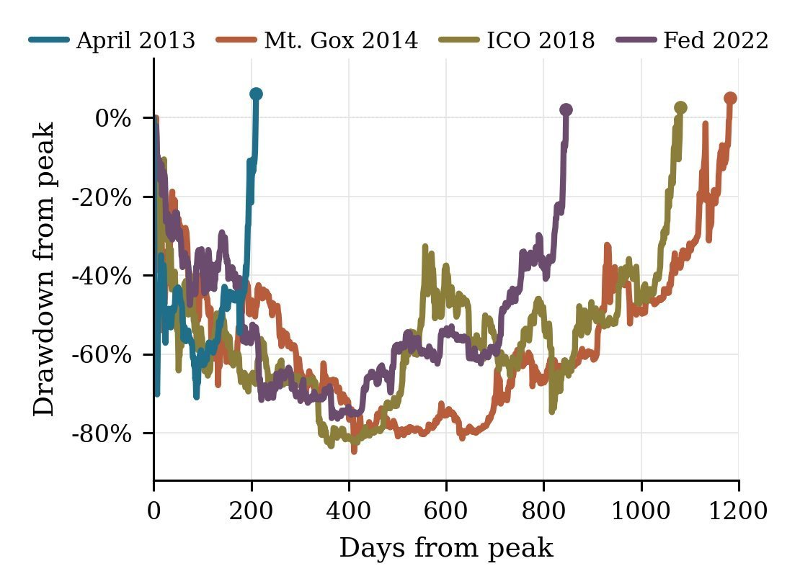
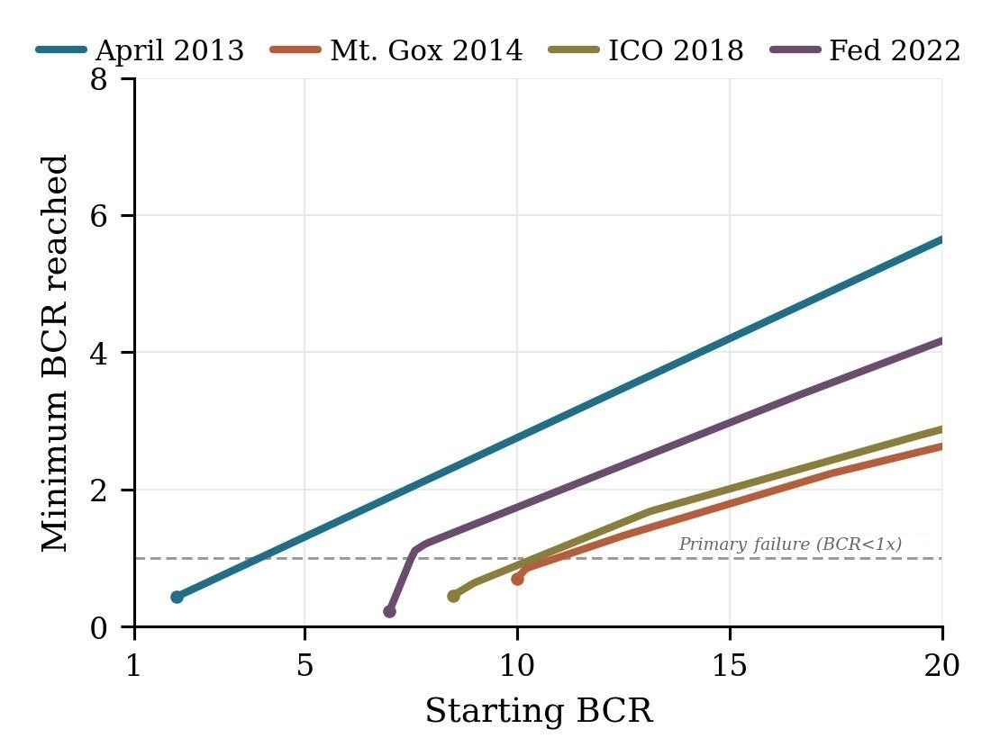
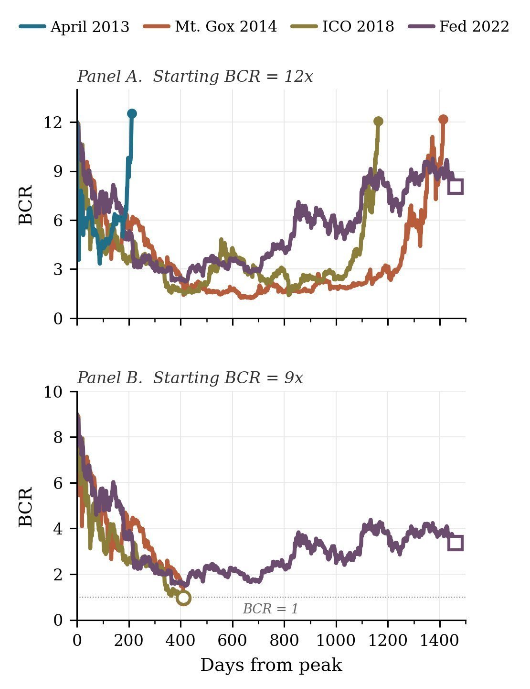
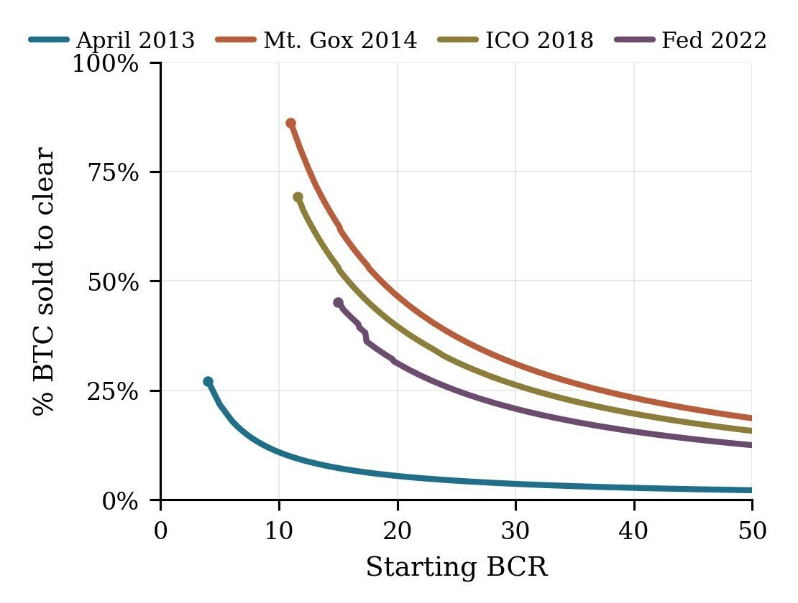
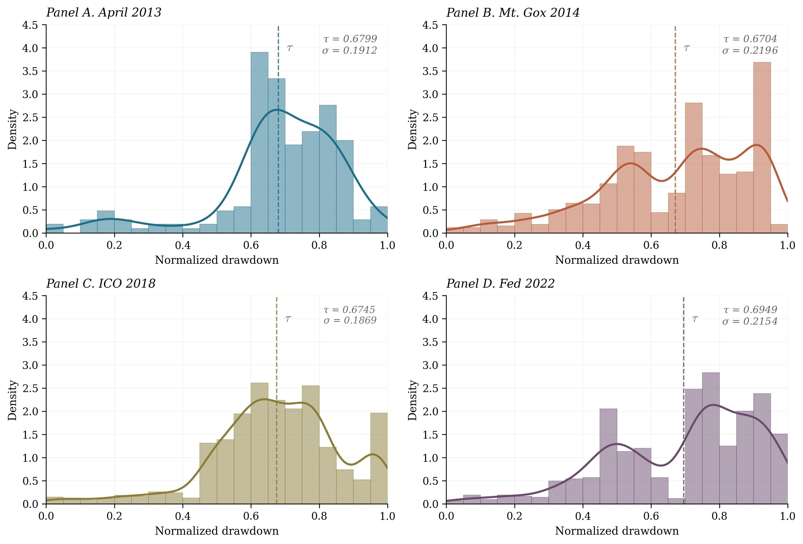
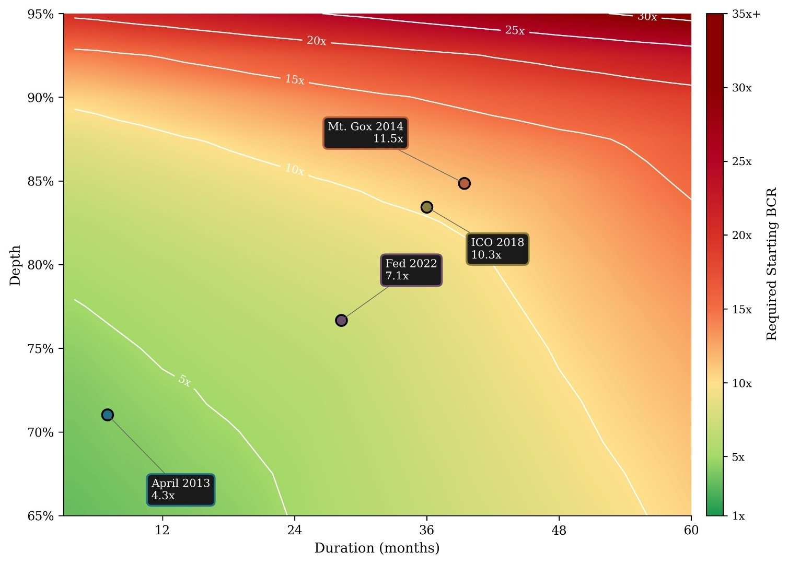
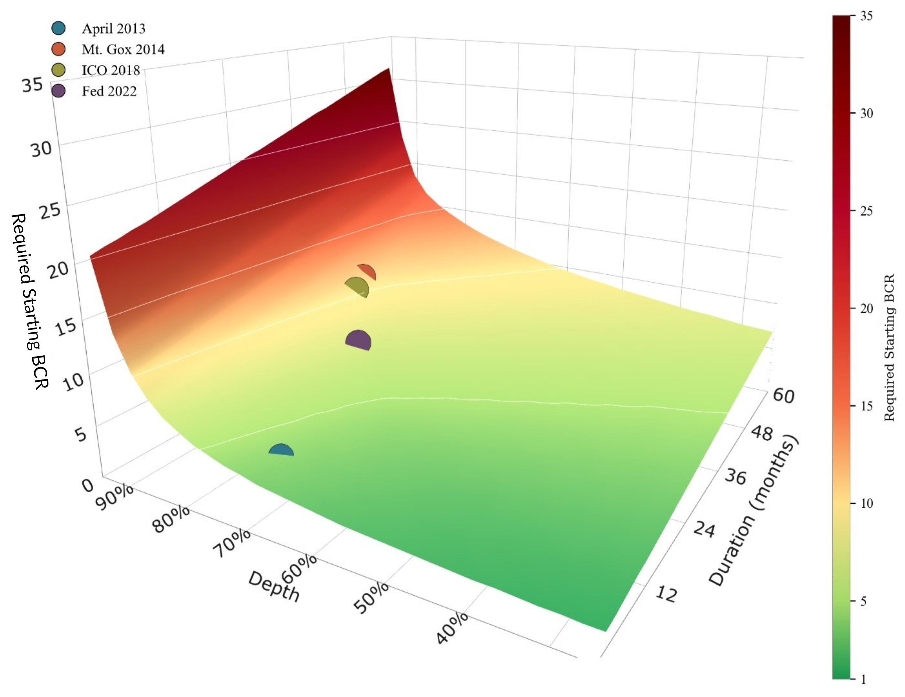
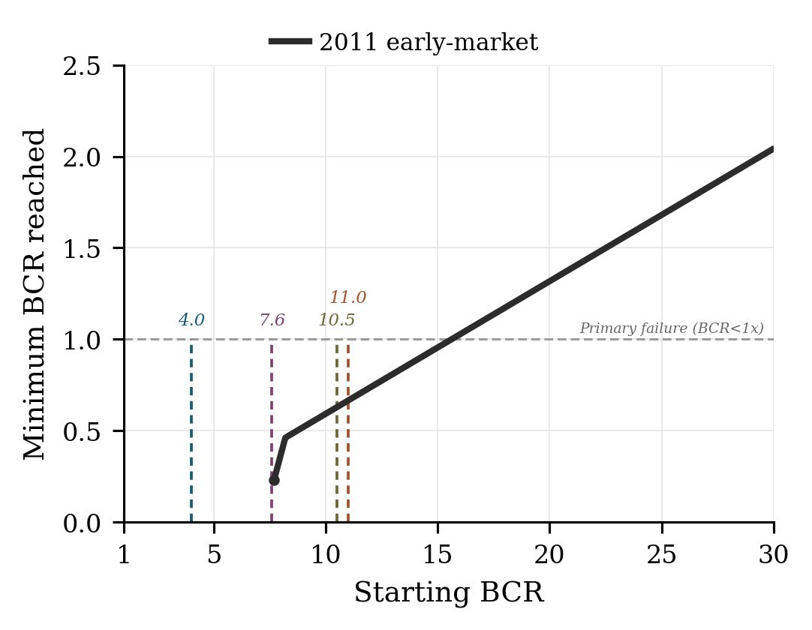
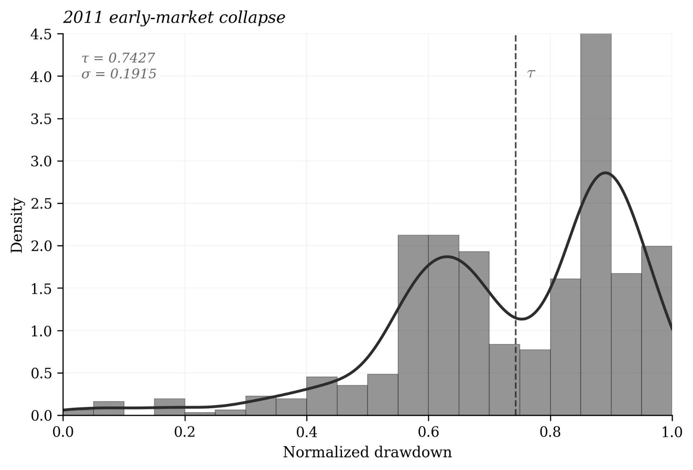

# Perpetual Preferred Equity Against Bitcoin: Required Coverage Across Observed Drawdowns

July 2026

---

### Abstract

Perpetual preferred equity issued against a Bitcoin reserve produces a forward-coverage problem. The measure of forward solvency is the Bitcoin Coverage Ratio (BCR): BTC reserve value over annual dividend obligation, in years of forward coverage. BCR collapses the preferred-to-reserve ratio and dividend rate into a single coverage statistic. Primary failure occurs at BCR<1x, where the reserve cannot cover one forward year of obligation. BCR is the sufficient parameter for forward solvency in the stripped pure-play model (no cash, no capital markets access, dividends funded entirely from BTC sales). The model is backtested across 245 starting BCR values per regime against four observed Bitcoin drawdowns: April 2013, Mt. Gox 2014, ICO Unwind 2018, and Fed Tightening 2022. Required starting BCRs for the three severe-depth multi-year regimes span 7.6x to 11.0x BCR. April 2013, the only short-duration regime, clears at materially lower coverage. These are stripped-model upper bounds. A real issuer with the optionality the model denies would clear the same regimes at lower coverage. Primary failure occurs well before the reserve is exhausted. Depth and duration both stress the structure, and their effects compound. The compounding depends on the drawdown's shape: the time spent at each depth, measured by the time-at-depth distribution. Across the regimes, the means of those distributions cluster tightly. Anchored on this clustering, a single coverage surface maps required starting BCR across depth and duration.

---

## 1 &nbsp; Introduction

Perpetual preferred equity issued against a Bitcoin reserve produces a forward-coverage problem. The reserve must fund the dividend obligation across whatever Bitcoin price path materializes. This paper measures the starting coverage required to clear observed Bitcoin drawdowns.

The Bitcoin Coverage Ratio (BCR) measures coverage of the dividend obligation in years. It is the sufficient parameter for forward solvency in the stripped model. A backtest applies the stripped pure-play structure to four historical Bitcoin drawdowns, locates the minimum coverage that clears each regime, and measures the cost of clearing each.

The stripped model denies the issuer optionality by design. Cash, capital markets access, and further equity issuance are removed from the model. Dividend obligations are funded entirely through the sale of Bitcoin. The required starting BCRs are upper bounds.

The paper covers four main-result regimes. The deepest regime in Bitcoin's recorded history, 2011, is reported separately in Appendix B with caveats.

The paper presents findings. It is not a comparison across specific issuers, not advocacy for or against the structure, and not a forecast.

## 2 &nbsp; The Instrument

The preferred shares are perpetual: no maturity, no principal repayment. They are equity, not debt. The reserve is Bitcoin.

The preferred carries a dividend obligation. Without a maturity event, solvency does not resolve at a single date. Solvency is a running condition.

This paper measures the structure in its pure-play form. The pure-play issuer holds Bitcoin against the preferred outstanding. There is no operating business, no other assets, and no other liabilities.

## 3 &nbsp; Framework: The Bitcoin Coverage Ratio (BCR)

On a pure-play balance sheet, forward solvency measurement reduces to a single ratio, the Bitcoin Coverage Ratio (BCR): BTC reserve value against the annual dividend obligation.

The preferred-to-reserve ratio is preferred notional divided by BTC reserve value; its reciprocal is reserve value per dollar of notional.[^fn-btc-rating] Either direction measures the notional against the reserve at a point in time. Neither measures forward solvency. Whether the reserve can fund the dividends the issuer has committed to pay through a drawdown is what determines whether a perpetual structure clears, and that is what BCR measures.[^fn-coverage-display]

$$ \text{BCR} = \frac{\text{BTC reserve value}}{\text{annual dividend obligation}} \tag{3.1} $$

The unit is years of forward coverage.

BCR collapses the preferred-to-reserve ratio and dividend rate into a single coverage statistic, normalizing exposure across capital structure. An issuer at a 25% preferred-to-reserve ratio with a 10% dividend rate has the same exposure as an issuer at 50% and a 5% dividend rate. Their obligations are identical. Both are 40x BCR.

The preferred-to-reserve ratio and dividend rate vary across issuers. At a given BCR, the obligations they produce do not.

Coverage measured in BCR units applies to any pure-play issuer of this structural form. In the stripped model, BCR is the sufficient parameter for forward solvency: the preferred-to-reserve ratio and dividend rate add no information beyond BCR.[^fn-bcr-identity]

BCR is invariant to scale. The same required starting BCR applies to a $1B issuer and a $100B issuer.

[^fn-btc-rating]: The notional is a liquidation preference, the preferred's senior claim ahead of common in a wind-up. It is not a dated payment obligation: a perpetual preferred has no maturity, so the preference is never called on a schedule. In pure-play form, Strategy publishes reserve value per dollar of notional as BTC Rating; see Strategy (2025). $250M notional at a 10% dividend rate carries the same dividend obligation as $500M at 5%. BCR reports this parity; BTC Rating reports a 2x spread between them.

[^fn-bcr-identity]: Algebraically, BCR = V/(c · N) for a pure-play issuer, where V is the BTC reserve value, N the preferred notional, and c the dividend rate. The annual dividend obligation is C = c · N, so BCR = V/C. Equivalently, BCR = 1/(c · (N/V)), where N/V is the preferred-to-reserve ratio.

[^fn-coverage-display]: As of July 2026, Strategy publishes this construction on its public credit dashboard as BTC Duration: the BTC Reserve over annualized interest and dividend obligations, in years. In the pure-play case, with no debt, it reduces to BCR. This paper models the pure-play case, defines the failure conditions on the ratio, and locates the empirical required starting BCRs across observed drawdowns. See Strategy (2026).

## 4 &nbsp; Failure Definitions

### 4.1 &nbsp; Primary Failure: Solvency (BCR < 1x)

The primary failure condition is the first day on which

$$ \text{BCR} = \frac{\text{BTC reserve value}}{\text{annual dividend obligation}} < 1.0 \tag{4.1} $$

1x BCR is the unique level at which the reserve holds exactly one forward year of the dividend obligation. The significance is arithmetic: below 1x, forward annual coverage is exhausted. The paper uses it as the primary failure condition because no behavioral overlay is needed to locate it.

BCR below 1x is not company failure. It is the point at which the reserve, with no cash, no access to capital markets, and dividends funded only by selling BTC, holds less than one forward year of the dividend obligation. Levels above 1x at which the market reprices or an issuer defers are behavioral and depend on assumptions this paper declines.

### 4.2 &nbsp; Secondary Failure: Terminal Liquidity

The secondary failure condition is the first day on which BTC value falls below the next monthly payment obligation. This is the mechanical floor.[^fn-terminal-liquidity]

It is not an alternative primary failure definition. It is the mechanical lower bound.

[^fn-terminal-liquidity]: Precisely, BCR ≈ 0.083x when BTC value equals one monthly payment (1/12 of annual obligation). Terminal liquidity is the first day BCR crosses below this value.

### 4.3 &nbsp; Primary-to-Terminal Gap

The primary-to-terminal gap is the calendar days between the primary and terminal events on the same path. It measures the conservatism of primary failure relative to the mechanical floor.

### 4.4 &nbsp; Preferred Pricing and Dividend Deferral

The preferred's price responds to market and instrument conditions beyond coverage. Dividend deferral can become a rational issuer choice under stress, and an issuer with the full optionality of their capital stack has incentive to act before BCR approaches either mathematical boundary. Estimating either response would require empirical observation of a distressed instrument of this structural form at scale, or a layering of sentiment, market access, and management discretion assumptions onto the mathematical model. No such observation exists, and the paper rejects that layering. Assumptions are a last resort by design. This paper addresses the mathematical boundaries.

## 5 &nbsp; Methodology

### 5.1 &nbsp; Stripped Model

The stripped model denies the optionality available to a real issuer.

Specification:

* Payment schedule: monthly
* Dividend funding: BTC sales only
* Dividend deferral: none
* Cash reserve: zero
* Capital markets access: none
* Further equity issuance: none

Monthly payment cadence is used; higher-frequency schedules produce negligibly different required starting BCRs.[^fn-payment-cadence]

The price paths are observed historical drawdowns. The combination requires no modeling assumptions: not about issuer behavior, not about volatility, distribution, or price dynamics.

No issuer has operated near the required starting BCRs this paper identifies. Bitcoin drawdowns have occurred during the operating history of issuers running this structure. Dividends have continued, with no relevant stress on the structure observed. Restoring the optionality the model denies would require assumptions about deployment behavior at those levels, which the stripped model does not make.

An issuer with the optionality the model denies would clear the same regime at materially lower coverage.

[^fn-payment-cadence]: Daily payment cadence (annual obligation divided by 365, paid at each daily close, otherwise identical engine configuration) was tested across the regime set. For the four main-result regimes, monthly and daily required starting BCRs differ by at most 0.1x BCR. Daily-cadence required-BCR shift per regime: Mt. Gox -0.1x, ICO -0.1x, Fed +0.1x, April unchanged. The 2011 regime shifts +0.3 BCR units. The cadence effect is regime-shape-dependent: monthly cadence concentrates sales at month-end closes, which can fall above or below intra-month average prices depending on drawdown shape.

### 5.2 &nbsp; Regime Selection and Scenario Design

Two data-design decisions define the backtest: which drawdowns to run and how many starting coverage levels to test against each.

**Regime selection.**

The four regimes are the distinct stress events in Bitcoin's price history. Three are multi-year drawdowns at severe depth (Mt. Gox 2014, ICO Unwind 2018, Fed Tightening 2022). April 2013 holds depth close to the cluster while shortening duration sharply: a 7-day 70% decline with a double-bottom shape. As the only short-duration regime in the set, it provides the structural counterpoint to the multi-year drawdowns.

| Regime | Peak | Trough | Depth | Peak-to-recovery | Context |
|---|---|---|---|---|---|
| April 2013 | Apr 9, 2013 / $229 | Jul 6, 2013 / $66.34 | 71.0% | 210 days | 7-day 70% flash crash, double bottom |
| Mt. Gox 2014 | Nov 29, 2013 / $1,132 | Jan 14, 2015 / $171 | 84.9% | 1,182 days | Exchange collapse, early ecosystem |
| ICO Unwind 2018 | Dec 16, 2017 / $19,188 | Dec 15, 2018 / $3,180 | 83.4% | 1,080 days | Post-ICO crackdown, regulatory pressure |
| Fed Tightening 2022 | Nov 8, 2021 / $67,559 | Nov 21, 2022 / $15,766 | 76.7% | 847 days | Rate hikes, Terra/Luna, FTX |


*Figure 1. Bitcoin drawdowns from peak across the four main-result regimes. Each line runs from peak through recovery (0%). Trough lows: April 2013 -71.0%; Mt. Gox 2014 -84.9%; ICO 2018 -83.4%; Fed 2022 -76.7%. Recovery dates: April day 210; Mt. Gox day 1,182; ICO day 1,080; Fed day 847. Source: Bitstamp daily close.*

The 2011 drawdown, with a peak that predates Bitstamp coverage and a reported low of $2.11[^fn-2011-drawdown], is reported separately in Appendix B with caveats. Other drawdowns from 2013 through the April 4, 2026 data cutoff are shallower or shorter versions of the included regimes. June 2019: 48.8%, 484 days. COVID 2020: 53.3%, 164 days. May 2021: 53.1%, 189 days. None adds relevant information beyond the selected set.

[^fn-2011-drawdown]: At the November 2011 cycle low, Bitcoin's circulating supply was approximately 7.69M BTC at $2.11, a total market capitalization of roughly $16M (CoinMetrics Reference Rate). A realistic preferred issuance against this reserve would have been a meaningful fraction of the entire asset. Price coverage is additionally Mt. Gox dependent, and the June 19, 2011 print of $0.01 is excluded as an exchange-compromise event unrepresentative of market price. Best-estimate backtest results are reported in Appendix B.

**Scenario count.**

Each regime runs against 245 starting BCR values, densified at the transition zones where required starting BCRs fall. This resolves required starting BCRs to 0.1x for both primary and terminal definitions.

**Regime window.**

The regime window is the calendar period from peak to a four-year cutoff. The window brackets the longest peak-to-recovery in the regime set (Mt. Gox 2014, 1,182 days). Each scenario terminates on the first day BCR returns to its starting value, at primary failure (BCR<1x), or at regime window end, whichever occurs first. Scenarios that reach window end without recovering or failing are reported as censored.

**Starting BCR.**

The model starts each scenario at the regime peak day, before the drawdown begins. This is the worst possible entry point. The structure carries its starting BCR into the full drawdown without the benefit of having already absorbed any decline.

An issuer's current BCR differs from the starting BCR used in this paper's backtest. When BTC trades below its prior peak, a structure's current BCR is lower than its peak-equivalent BCR. To compare current coverage against the required starting BCRs reported in this paper, normalize to peak:

*Peak-equivalent BCR ≈ current BCR × (ATH price ÷ current price)*

The normalization is conservative: it does not account for obligations paid since the peak.

## 6 &nbsp; Results

Each regime has a required starting BCR: the lowest starting coverage that holds BCR above 1x throughout the drawdown.

### 6.1 &nbsp; Multi-Year Cluster

Three multi-year regimes produce required starting BCRs spanning 7.6x to 11.0x.


*Figure 2. Minimum BCR reached on the mechanical continuation, by starting BCR. Each curve clears y=1 at the regime's required starting BCR.*

| Regime | Depth | Peak-to-recovery | Required starting BCR |
|---|---|---|---|
| Mt. Gox 2014 | 84.9% | 1,182 days | 11.0x |
| ICO Unwind 2018 | 83.4% | 1,080 days | 10.5x |
| Fed Tightening 2022 | 76.7% | 847 days | 7.6x |

These are stripped-model required starting BCRs. A real issuer with the optionality the model denies would clear the same regime at lower coverage.

The three regimes span 77-85% depth and 847-1,182 days peak-to-recovery, producing required starting BCRs that span 3.4x.

Within the cluster, required starting BCRs order by duration. Mt. Gox at 1,182 days clears at 11.0x. ICO at 1,080 days clears at 10.5x. Fed at 847 days clears at 7.6x. Depth orders the same way: Mt. Gox 84.9%, ICO 83.4%, Fed 76.7%. Both axes track the same ordering across these three regimes.

The proportional movement is uneven. Mt. Gox to ICO shortens duration by 102 days and lowers the required starting BCR by 0.5x. ICO to Fed shortens duration by 233 days and lowers it by 2.9x. Three observations do not support a slope.

### 6.2 &nbsp; April 2013: Depth Held, Duration Shortened

April 2013 holds depth close to the multi-year cluster while shortening duration sharply. Depth holds within 6 points of the cluster's lower edge. Duration shortens by 75%. The shape is a double-bottom: a 7-day flash crash drives the price to -70% off peak; an echo then re-tests the low and extends the trough to -71% at day 88.

April 2013 clears at 4.0x, roughly half the coverage of Fed at 7.6x and well below the cluster's upper edge at 11.0x.

April 2013's required starting BCR sits 1.0x above the level that clears terminal liquidity (3.0x). The same spread is 1.4x for Mt. Gox (9.6x), 2.1x for ICO (8.4x), and 0.6x for Fed (7.0x). April 2013's spread sits inside the multi-year range. The spread does not separate short-duration from long-duration regimes.

### 6.3 &nbsp; Cost of Survival

Cost of survival is the percent of BTC reserve sold to meet monthly dividend obligations through BCR recovery to starting coverage.

Recovery lag is the calendar days between price recovery to peak and BCR recovery to starting coverage. It measures how long the structure operates below starting coverage after price has fully recovered. Clearance is not the same as recovery. A structure can clear primary, hold below starting coverage through the recovery path, and still not return to starting coverage by the window cutoff. Recovery lag quantifies that overhang.

**Cost of survival at lowest recovered.** The measure is defined only for paths that return to starting coverage. Each regime is therefore read at its lowest-recovered BCR: the lowest starting BCR that recovered within the regime window.

| Regime | Required starting BCR | Lowest recovered BCR | % BTC sold | Recovery lag | Minimum BCR |
|---|---|---|---|---|---|
| April 2013 | 4.0x | 4.0x | 27.2% | 3 days | 1.01 |
| Mt. Gox 2014 | 11.0x | 11.0x | 86.2% | 270 days | 1.01 |
| ICO Unwind 2018 | 10.5x | 11.6x | 69.3% | 134 days | 1.29 |
| Fed Tightening 2022 | 7.6x | 15.0x | 45.1% | 527 days | 2.94 |

Lowest-recovered BCR does not order with the required starting BCR. Among the multi-year regimes, Fed 2022 has the lowest required starting BCR (7.6x), yet its lowest-recovered BCR (15.0x) is the highest of the four. Shallower depth admits a lower required starting BCR; the return to starting coverage depends instead on the % BTC sold during the drawdown (set by depth, duration, and shape) and the size of the post-price-recovery overshoot. A larger overshoot returns more heavily depleted structures to starting coverage, narrowing the spread between lowest-recovered and the required starting BCR. In Fed the overshoot ran 85% above the 2021 peak, enough to rebuild structures at 15.0x and above but not the band between 7.6x and 15.0x. That band cleared primary without returning to starting coverage by the four-year window cutoff: censored, an open outcome rather than a failure. ICO shows a smaller but similar spread. Mt. Gox 2014 shows no spread: a 772% overshoot above the 2013 peak restored even the structure that sold 86.2%.


*Figure 3. BCR paths through each regime at constant starting coverage, illustrating that clearance and recovery are distinct outcomes. Panel A: four regimes at 12x BCR. April 2013, ICO, and Mt. Gox recover within window; Fed 2022 censored at window end without returning to 12x despite never failing. Panel B: three regimes at 9x BCR. Mt. Gox and ICO cross BCR<1x and the path stops at primary failure (day 411, open circles)[^fn-day411-convergence]. Fed clears primary but is censored at window end without returning to 9x. April 2013 omitted (well above primary at 9x).*

[^fn-day411-convergence]: Mt. Gox 2014 and ICO 2018 both cross BCR<1x on day 411 at 15-18% of peak Bitcoin price.

At lowest-recovered, time spent near primary failure (measured as days below 2x BCR) varies sharply across regimes. Mt. Gox 2014 spends 822 days below 2x; ICO 2018 spends 200 days; April 2013 spends 167 days; Fed Tightening 2022 stays above 2x throughout (minimum BCR 2.94). Clearance and time near primary failure are distinct dimensions of cost.

Cost varies across the regime set. Mt. Gox at 11.0x sells 86.2% of its BTC reserve to clear; April 2013 at 4.0x sells 27.2%.


*Figure 4. Cost of survival (percent of BTC reserve sold) by starting BCR for each regime. Each curve begins at the regime's lowest-recovered BCR. Absolute cost varies across regimes.*

The percent of BTC sold at a given starting BCR is empirical, set by the regime's depth, duration, shape, and recovery path. The inverse scaling with starting BCR is definitional: the annual obligation is the reserve over the starting BCR, so doubling the starting BCR halves the obligation and, on the same price path, roughly halves the BTC sold.

### 6.4 &nbsp; Primary-to-Terminal Gap

The primary-to-terminal gap measures the calendar days between the primary event (BCR<1x) and the secondary event (terminal liquidity) on a single path.

Scenarios are included only when both events occur within the regime window. For some failing scenarios, terminal liquidity is not observed within the window (either because it lies beyond the cutoff or because strong price recovery prevents the reserve from reaching the floor); these are not counted. This is most consequential for April 2013, where rapid price recovery slows post-primary-failure reserve depletion, often preventing terminal liquidity from occurring.

| Regime | Scenarios with both events | Min (days) | Median (days) | Max (days) |
|---|---|---|---|---|
| April 2013 | 20 | 149 | 735 | 1,326 |
| Mt. Gox 2014 | 68 | 151 | 302 | 896 |
| ICO Unwind 2018 | 56 | 135 | 295 | 1,060 |
| Fed Tightening 2022 | 42 | 173 | 235 | 1,005 |

Gap days range from 135 to 1,326 across the regime set. Multi-year regime medians cluster at 235-302 days. April 2013, the shortest-duration regime, carries both the longest median gap (735 days) and the longest single-scenario gap (1,326 days). Gap magnitude does not order with regime duration.

The gap quantifies how much definitional breathing room primary failure provides above the mechanical floor. A structure that has crossed BCR<1x retains operational runway before reaching terminal liquidity. With price flat, dividends alone drain the reserve from 1x to the 0.083x floor (one month of coverage). That sets a baseline of about eleven months, near 335 days. Deviation from the baseline reflects the price path after primary failure.

Below the baseline, BTC keeps falling and the drawdown drives BCR down faster than dividends alone. The gap compresses, and the multi-year medians sit here at 235-302 days. Above the baseline, BTC recovers past its trough. BCR is then pulled down only by the BTC sold for dividends and pushed back up by the rising price, which stretches the gap. The longest paths sit here at 896-1,060 days, and April 2013's sharp rebound is why its gaps run longest.

### 6.5 &nbsp; Scope of the Findings

What the required starting BCRs are:

* Upper bounds on forward-coverage requirements.
* Specific to the observed depth-duration space of the four regimes.
* Resolved to 0.1x on both primary and terminal.

What the required starting BCRs are not:

* Not measures of preferred pricing or dividend deferral. The numbers in this paper do not address the price at which the preferred trades, nor the level at which dividend deferral becomes a rational issuer choice.
* Not predictions. The backtest runs observed price paths through a stripped structure. It does not forecast future regimes, future required starting BCRs, or future issuer behavior.
* Not distributional statements. Four regimes are not a sample in the statistical sense. The required starting BCRs are point observations on the specific drawdowns examined.
* Not applicable to regimes structurally unlike those examined.

### 6.6 &nbsp; Time-at-Depth and the Coverage Surface

The starting BCR that clears a drawdown depends on the drawdown's depth, duration, and time-at-depth distribution. Across the three multi-year regimes the mean of that distribution clusters tightly. Holding the pooled mean and standard deviation fixed, a single coverage surface maps the required starting BCR across depth and duration.

#### 6.6.1 &nbsp; Time-at-Depth Distribution

The time-at-depth distribution measures how much time a regime spends at each normalized drawdown level. Normalizing drawdown to its own maximum isolates shape from magnitude, allowing time-at-depth distributions to be compared across regimes. Summary moments are τ (mean) and σ (population standard deviation, ddof=0).

| Regime | τ | σ |
|---|---|---|
| April 2013 | 0.6799 | 0.1912 |
| Mt. Gox 2014 | 0.6704 | 0.2196 |
| ICO Unwind 2018 | 0.6745 | 0.1869 |
| Fed Tightening 2022 | 0.6949 | 0.2154 |

Histogram shapes vary across regimes, but the means span just 3.6%, the standard deviations 15.8%.


*Figure 5. Time-at-depth histograms for the four main-result regimes, with τ (mean) marked as a dashed vertical line and τ, σ annotated per panel. Normalized drawdown on the horizontal axis (0 at peak, 1 at trough); density on the vertical axis.*

Because the means cluster tightly, the required starting BCR ordering tracks depth and duration directly, and holding (τ, σ) fixed while depth and duration vary should reproduce each regime's required starting BCR. The shape is pooled from the three multi-year regimes (Mt. Gox 2014, ICO Unwind 2018, Fed Tightening 2022). April 2013, the short-duration regime, is held out as an out-of-sample check.

#### 6.6.2 &nbsp; Surface Construction and Fit Check

The surface reproduces all four regimes' required starting BCRs at or within ±0.5 BCR.[^fn-anchor] Three are the pool the surface is built on, and April 2013 is out-of-sample.

| Regime | Empirical | Synthetic | Δ |
|---|---|---|---|
| April 2013 | 4.0x | 4.3x | +0.30 |
| Mt. Gox 2014 | 11.0x | 11.5x | +0.50 |
| ICO Unwind 2018 | 10.5x | 10.3x | -0.20 |
| Fed Tightening 2022 | 7.6x | 7.1x | -0.50 |

[^fn-anchor]: All synthetic paths start at the pool's median calendar date, 2017-12-16 (ICO Unwind 2018 peak). The calendar start date positions monthly payment days within each synthetic path. Per-regime peak-date sensitivity is reported in Appendix C; required starting BCRs shift by at most 0.3 BCR.

April 2013 is the out-of-sample test. It sits 5.7 points shallower in depth and 75% shorter in duration than the pool minimum. The surface, built without it, reproduces its required starting BCR within 0.3x. April's τ matches the pool mean to four decimals and its σ (0.1912) sits within the pool σ range, so the check is on the depth-duration extrapolation under approximately matched shape.

Residuals across the four regimes range from 0.2 to 0.5 BCR in absolute value. The model is a symmetric two-parameter shape family fitted to the pooled (τ, σ); see Appendix C for the functional form, (p, q) solver, and calendar conventions.

#### 6.6.3 &nbsp; Reading the Coverage Surface

The coverage surface shows how required coverage varies across depth and duration. Figure 6 shows it as a heatmap, with depth on the Y axis, duration on the X axis, and color shading encoding required starting BCR. Figure 7 renders the same surface in three dimensions, with required starting BCR on the vertical axis. Both figures mark each regime's (depth, duration); Figure 6 labels each marker with the synthetic required starting BCR, Figure 7 plots each at the empirical required starting BCR on the vertical axis. The synthetic at each regime's (depth, duration) reproduces the empirical required starting BCR at or within ±0.5 BCR per §6.6.2; in Figure 7 this residual is visible as how each marker sits relative to the surface. Each constant-BCR contour traces the (depth, duration) combinations a structure at that starting BCR clears, visible in both views.

The surface reports the minimum starting BCR that clears BCR<1x throughout a synthetic drawdown at the given depth and duration, with time-at-depth moments (τ, σ) held at the pooled values of the three multi-year stress regimes (τ = 0.6799, σ = 0.2073).


*Figure 6. Coverage surface heatmap across depth 65-95% and duration 3-60 months, containing the four observed regimes at depth 71-85% and duration 7-39 months. Color shading encodes required starting BCR. White contour lines at 5x, 10x, 15x, 20x, 25x, and 30x. Four regime markers at each regime's observed (depth, duration); labeled values are synthetic required starting BCRs from §6.6.2, which reproduce empirical required starting BCRs (4.0x, 7.6x, 10.5x, 11.0x) at or within ±0.5 BCR.*


*Figure 7. Coverage surface across wider bounds (depth 20-95%, duration 0-60 months) for shape intuition. The four observed regimes anchor the empirical envelope at depth 71-85% and duration 7-39 months; the surface extends past this envelope on all sides as extrapolation. Surface values come from synthetic paths generated at pooled (τ, σ). White contour lines at 5x, 10x, 15x, 20x, and 25x. Spheres sit at each regime's empirical required starting BCR; how each sphere sits relative to the surface shows the synthetic residual.*

The four observed regimes sit at 71-85% depth and 7-39 months duration. Figure 6 spans 65-95% depth and 3-60 months; Figure 7 spans a wider 20-95% depth and 0-60 months for shape intuition. Values outside the observed regimes are extrapolation.

The surface is not a forecast of future regimes and not a precision prediction tool for arbitrary (depth, duration) pairs. The pooled (τ, σ) assumption holds time-at-depth shape constant. A future regime that differs in shape would carry a required starting BCR the surface does not capture. The surface supports qualitative intuition about how depth and duration compound; it is not a quantitative prediction tool.

## 7 &nbsp; Forward Applicability

### 7.1 &nbsp; BCR Portability

The required starting BCRs apply to any pure-play issuer of this structural form regardless of scale, preferred-to-reserve ratio, or dividend rate. BCR is scale-invariant; the framework is portable across issuers within the pure-play scope.

### 7.2 &nbsp; Regime-Structure Dependence

The required starting BCRs apply to drawdowns of similar structure to those examined. The regime set holds severe depth (71-85%) while varying in duration (210-1,182 days peak-to-recovery), with time-at-depth moments clustered at pooled (τ = 0.6799, σ = 0.2073).

### 7.3 &nbsp; Depth and Duration: Compounding Stress

Within the four observed regimes (71-85% depth), depth and duration both move the required starting BCR. April 2013 separates from the three multi-year regimes primarily through duration, 75% shorter than the shortest of them, holding depth close to their lower edge: its required starting BCR is 4.0x against the multi-year range of 7.6-11.0x. Within the multi-year regimes, depth orders the required starting BCRs in the same direction as duration: Mt. Gox at 84.9% depth and 1,182 days requires 11.0x; ICO at 83.4% and 1,080 days requires 10.5x; Fed at 76.7% and 847 days requires 7.6x. 2011 (Appendix B), at 92.7% depth and τ above the pool maximum, sits past the multi-year regimes on both axes: its required starting BCR of 15.7x exceeds Mt. Gox's 11.0x despite shorter duration. Extreme values on either axis move the required starting BCR materially.

The perpetual structure carries dividend obligation through the drawdown without maturity events to force resolution. In this model, the only path to failure is the running condition: satisfying dividend obligations over duration against a diminishing reserve. A deeper drawdown forces more BTC sold to fund each dividend. A longer drawdown funds more dividends from sales. A deep, long drawdown sells BTC at lower prices for longer, drawing the reserve down faster than depth or duration alone. Depth and duration do not stress the structure proportionately, but their effects compound one another. §6.6 maps this compounding to required coverage.

### 7.4 &nbsp; Limits

Limits on forward applicability.

**Preferred pricing and dividend deferral** are not addressed here. Estimating either requires observation of a distressed instrument of this structural form at scale or assumptions about market conditions and issuer behavior under distress.

**Market depth.** The framework assumes issuance scale that does not materially affect Bitcoin's price discovery. The 2011 regime in Appendix B illustrates where this condition does not hold.

**Price-taking sell-side.** Dividend-funding sales are modeled as price-takers. At institutional issuance scales, cumulative sales are small relative to Bitcoin's market liquidity; very large issuance in severe drawdowns could deserve explicit feedback modeling.

**BTC-sales assumption.** The cost-of-survival figures in §6.3 reflect the stripped model's assumption that dividends are paid by selling BTC under distress. Strategic BTC sales are operationally distinct from this model.

**Time-at-depth shape.** The §6.6 coverage surface holds time-at-depth shape constant at the pool's (τ, σ) = (0.6799, 0.2073). The surface does not address regimes whose time-at-depth distributions differ materially from these pooled values.

**Extensions.** The stripped-model framework provides an upper-bound baseline; assumption-layered extensions can refine these bounds. Methodology and code in Appendix C enable replication and extension.

## 8 &nbsp; Conclusion

The three multi-year regimes cleared at required starting BCRs of 7.6x (Fed Tightening 2022), 10.5x (ICO Unwind 2018), and 11.0x (Mt. Gox 2014). April 2013, the one short-duration regime, cleared at 4.0x.

Any Bitcoin Coverage Ratio can be converted to a preferred-to-reserve ratio:

*starting preferred-to-reserve ratio = 1 / (required starting BCR × dividend rate)*

BCR collapses the preferred-to-reserve ratio and dividend rate into a single coverage statistic. The conversion back to a preferred-to-reserve ratio requires a dividend rate. The table below translates the four regimes' required starting BCRs to starting preferred-to-reserve ratios at a 10% dividend rate.

| Regime | Required starting BCR | Starting preferred-to-reserve ratio (10% dividend) |
|---|---|---|
| April 2013 | 4.0x | 250.0% |
| Fed Tightening 2022 | 7.6x | 131.6% |
| ICO Unwind 2018 | 10.5x | 95.2% |
| Mt. Gox 2014 | 11.0x | 90.9% |

At a 10% dividend rate, an issuer entering Mt. Gox 2014 at or below a 90.9% starting preferred-to-reserve ratio held BCR above 1x throughout, with no capital markets access, no cash, and dividends funded only by selling Bitcoin.

These figures are starting preferred-to-reserve ratios, measured at the regime peak. Once BTC trades below its prior peak, an issuer's current preferred-to-reserve ratio sits above its peak-equivalent value. To compare a current preferred-to-reserve ratio against these figures, normalize to peak:

*Peak-equivalent preferred-to-reserve ratio ≈ current preferred-to-reserve ratio × (current price ÷ ATH price)*[^fn-peak-amp]

Appendix A reports the minimum BCR reached in each regime across the full range of starting BCRs, for reading coverage at levels between and beyond the four clearing points.

These are historical statements about four observed drawdowns under a stripped model. They are not underwriting guidance and not forecasts of future coverage requirements.

These required starting BCRs are stripped-model upper bounds, equivalently lower bounds on the starting preferred-to-reserve ratio that clears. A real issuer with the optionality the model denies clears the same drawdowns at lower coverage, which is a higher starting preferred-to-reserve ratio than the figures above.

[^fn-peak-amp]: The price factor inverts the peak-equivalent BCR normalization in §5.2 (current price ÷ ATH price, not ATH ÷ current), because at a fixed dividend rate the preferred-to-reserve ratio is inversely proportional to BCR. Both omit obligations paid since the peak: §5.2's omission understates peak-equivalent BCR, and this one overstates the peak-equivalent preferred-to-reserve ratio.

## Appendix A &nbsp; Forward Coverage Reference

The table reports minimum BCR reached across each main-result regime, indexed by starting BCR. At any starting coverage level, the minimum BCR reached in each historical regime can be read directly off the row. Numerical cells report the minimum BCR reached. Cells marked '–' indicate primary failure within the regime window.

| Starting BCR | April 2013 | Mt. Gox 2014 | ICO 2018 | Fed 2022 |
|---|---|---|---|---|
| 100x | 28.82 | 14.74 | 16.14 | 22.80 |
| 90x | 25.93 | 13.23 | 14.48 | 20.46 |
| 80x | 23.03 | 11.71 | 12.82 | 18.13 |
| 70x | 20.13 | 10.20 | 11.16 | 15.79 |
| 60x | 17.24 | 8.69 | 9.51 | 13.46 |
| 50x | 14.34 | 7.17 | 7.85 | 11.13 |
| 40x | 11.44 | 5.66 | 6.19 | 8.79 |
| 30x | 8.55 | 4.14 | 4.54 | 6.46 |
| 25x | 7.10 | 3.39 | 3.71 | 5.29 |
| 20x | 5.65 | 2.63 | 2.88 | 4.13 |
| 15x | 4.20 | 1.79 | 2.01 | 2.94 |
| 12x | 3.33 | 1.22 | 1.40 | 2.21 |
| 10x | 2.75 | – | – | 1.72 |
| 8x | 2.17 | – | – | 1.23 |
| 5x | 1.30 | – | – | – |

## Appendix B &nbsp; 2011 Best-Estimate Results

The 2011 early-market drawdown is reported separately because several conditions distinguish it from the four main-result regimes. Bitcoin's market capitalization at the cycle low of $2.11 was approximately $16M, against which a realistic preferred issuance would have been a meaningful fraction of the entire asset. Price coverage in the regime is materially Mt. Gox dependent. The June 19, 2011 print of $0.01 is excluded as an exchange-compromise event unrepresentative of market price.

Subject to those caveats, the regime is processed under the same methodology as the main-result regimes, with prices sourced from the CoinMetrics reference rate (CoinMetrics; Bitstamp data begins after the June 2011 peak).

Both required-BCR rows below report the lowest starting BCR that clears the named condition (primary failure at BCR<1x; terminal liquidity at the mechanical floor), not the BCR observed at that condition.

| Metric | Value |
|---|---|
| Peak | June 8, 2011 / $29.03 |
| Trough | November 18, 2011 / $2.11 |
| Depth | 92.7% |
| Peak-to-recovery | 622 days |
| Required starting BCR (primary) | 15.7x |
| Required starting BCR (terminal) | 7.7x |
| Primary-to-terminal spread | 8.0x |

The 8.0x primary-to-terminal spread is wider than any main-result regime. Severe depth (92.7%) drives the required starting BCR high. Reserve deterioration during active price drawdown drives BCR below 1x without extended dividend depletion. The sharp post-trough recovery prevents terminal liquidity at materially lower starting BCRs.

The required starting BCR and lowest recovered BCR coincide at 15.7x; no scenarios are censored. 2011's time-at-depth distribution sits above the pool mean used by the surface (τ = 0.7427 versus 0.6799): the drawdown spent more of its window at deeper relative depths. Shape stress on its own would widen the spread between clearance and return to starting coverage. The spread collapses to zero anyway, paralleling Mt. Gox 2014 and April 2013 (both 0.0x); ICO 2018 (1.1x) and Fed 2022 (7.4x) show non-zero spreads. Post-price-recovery overshoot compensates sharply.


*Figure B1. Minimum BCR reached on the mechanical continuation, by starting BCR, for the 2011 regime, with the four main-result regimes' required starting BCRs shown as vertical reference lines. The curve rises linearly from near the 7.7x level that clears terminal liquidity, clearing primary at 15.7x.*

**Position relative to the coverage surface.**

The 2011 regime sits well outside the depth-duration space of the four main-result regimes. Depth exceeds the deepest main-result regime (Mt. Gox at 84.9%) by 7.8 points. The required starting BCR of 15.7x exceeds Mt. Gox's 11.0x by 4.7 BCR units. 2011's depth-normalized τ at 0.7427 sits 0.0478 above the pool maximum (Fed 2022 at 0.6949). σ at 0.1915 sits within the pool range.

| Metric | 2011 | Pool min | Pool max | Pool mean |
|---|---|---|---|---|
| Depth-normalized τ | 0.7427 | 0.6704 | 0.6949 | 0.6799 |
| Depth-normalized σ | 0.1915 | 0.1869 | 0.2196 | 0.2073 |

2011 is not included in the coverage surface. Querying the coverage surface at 2011's (92.7%, 622 days) returns 17.3x required starting BCR, against the empirical 15.7x. The +1.6 BCR overshoot occurs at a point beyond the surface's fit envelope on both depth (7.8 points deeper than Mt. Gox at 84.9%) and τ (0.0478 above the pool maximum at Fed 2022, indicating more time near the trough). Higher τ under matched depth-duration would raise the synthetic required starting BCR, so the τ excursion alone cannot explain the overshoot. The surface is fit on three multi-year regimes via a symmetric two-moment shape family; severe-depth conditions like 2011 admit potential extensions to this construction (additional moments capturing asymmetry, fits anchored on deeper drawdowns) outside its scope.


*Figure B2. Time-at-depth distribution for the 2011 regime, with τ (mean) marked as a dashed vertical line and τ, σ annotated. Normalized drawdown on the horizontal axis (0 at peak, 1 at trough); density on the vertical axis.*

**Cost of survival at lowest recovered.**

| Regime | Required starting BCR | Lowest recovered BCR | % BTC sold | Recovery lag | Minimum BCR |
|---|---|---|---|---|---|
| 2011 early-market | 15.7x | 15.7x | 47.0% | 28 days | 1.01 |

The 2011 results are reported for completeness. The 2011 regime sits outside the depth-duration space of the four main-result regimes, and the conditions noted above further limit its forward applicability.

## Appendix C &nbsp; Reproducibility

The data export underlying this paper is reproducible from the canonical engine, two raw price sources, and one preprocessing step, all published at https://github.com/jacksonfairbanks/perpetual-preferred-against-bitcoin-backtest.

**Engine.** `src/solvency-engine.js`. Function `runSolvencyOnDailyPath`. SHA-256 `e29e1d1e9621c85d8997389e20c1c6c727e4a2fa44abe33bdb6963ee6e4ff00e`.

Engine configuration for this paper: monthly payment cadence at calendar month-end, payment executed at same-day close. Cadence is the only configurable engine parameter; the stripped-model assumptions (§5.1) are encoded directly in the engine. Path truncates at primary failure (BCR<1x), at regime window end, or at reserve recovery (the first day the BTC reserve value returns to its initial level after a drawdown; equivalent to BCR returning to starting under constant annual obligation), whichever comes first. A parallel mechanical continuation continues paying monthly dividends past primary failure to locate terminal liquidity. The engine is deterministic; given identical inputs it produces identical output across runs and platforms. The cadence parameter is configurable; the current engine reproduces the prior canonical monthly output byte-identically. Code-level identifiers in this version of the engine and export pipeline use the paper's vocabulary throughout: primary failure (BCR<1x) and terminal liquidity. CSV columns and the `terminal_state` field were renamed accordingly: reserve columns use `btc_reserve_*` and clearing-level columns use `required_starting_bcr_*` (terminal-liquidity sense `required_starting_bcr_terminal_*`). Prior column names are retained only in the rename map at `outputs/manifest.json` under `data_dictionary.renames_from_prior_drafts`.

**Surface code.** `scripts/build-surface.js`. Generates the §6.6 coverage surface from pooled (τ, σ) computed across the three pool regimes.

**Price sources.**

Bitstamp daily close, 2011-08-18 to 2026-04-04, 5,344 rows. SHA-256 `978ad50a50bf22be09d9a18b1517202d71f15cea7bed46d93e445a3af1810146`. Used for the April 2013, Mt. Gox 2014, ICO 2018, and Fed 2022 regimes. Preprocessed via `scripts/preprocess-bitstamp.js` with last-observation-carried-forward imputation so every calendar month-end carries a price for monthly dividend execution. Imputation audit at `data/btc-prices-bitstamp-imputation.json`.

CoinMetrics reference-rate BTC/USD daily series, 2011-06-08 to 2015-12-31, 1,668 rows. SHA-256 `690e81b45a03c35b45a907a1baab2e44532f33ac4c5c5f152457f3c1b63e1eba`. Used for the 2011 regime (Appendix B). Bitstamp begins after the June 2011 peak; CoinMetrics anchors the regime on the actual peak.

**Sweep grid.** 245 starting BCR values per regime: integers 1 through 100, half-step densifiers at 8.5, 9.5, 10.5, 11.5, 12.5, 13.5, 14.5, 15.5, and 0.1-step densifier zones at 1.0-2.0, 2.0-4.0, 6.0-7.0, 7.0-8.0, 8.0-10.0, 10.0-12.0, and 13.0-20.0. The integer grid resolves required starting BCRs to within 1 BCR unit; densifier zones resolve each regime's required-BCR boundaries to 0.1.

**Surface methodology.** The §6.6 coverage surface is constructed by procedures layered on top of the engine. The following conventions govern this construction.

**Depth-normalization.** τ and σ are computed on the depth-normalized trajectory, drawdown_from_peak / max_drawdown_from_peak, over the peak-to-recovery window. Normalizing to unit depth isolates shape from magnitude, making moments comparable across regimes of different depths.

**Standard-deviation convention.** σ is the population standard deviation (denominator N, ddof=0), not the Bessel-corrected sample form (N-1, ddof=1).

**Symmetric two-parameter family.** Synthetic price paths are generated from a symmetric two-parameter shape. With t ∈ [0,1] indexing normalized time:

```
base(t)     = (4t(1 - t))^p
profile(t)  = 1 - (1 - base(t))^q
drawdown(t) = depth · profile(t)
price(t)    = peak · (1 - drawdown(t))
```

The path is symmetric about t=0.5, endpoints pinned at peak, with maximum drawdown of `depth` reached at t=0.5. (p, q) are fitted by nested bisection to match target (τ, σ) within tolerance 0.005 per moment.

**Calendar conventions.** All synthetic paths in §6.6.2 share a calendar start date of 2017-12-16, the in-pool median peak (ICO Unwind 2018). This matches the start date used by the 961-cell surface grid that Figures 6 and 7 display. The grid spans depth 20-95% at 2.5-point increments and duration 0-1800 days at 60-day increments (31 × 31). With this start date, the surface reproduces historical required starting BCRs at or within ±0.5 BCR (`surface_grid_validation.csv`): April 2013 +0.30, ICO Unwind 2018 -0.20, Mt. Gox 2014 +0.50, Fed Tightening 2022 -0.50. Starting each synthetic path from its own regime's peak date is reported separately in `surface_validation.csv` as a sensitivity check; synthetic required starting BCRs shift by at most 0.3 BCR (April 2013).

**Day-count conventions.** Duration values reported in paper tables and prose are elapsed days from peak date to recovery date (date arithmetic). σ values reported in §6.6.1 and Appendix B are computed over the inclusive daily observation count (peak day through recovery day, n = elapsed days + 1). Both fields are exposed in `regime_descriptors.csv` (`days_peak_to_recovery` and `n_days` respectively).

**Asymmetric families.** Asymmetric variants of the shape family (separate parameters for the fall and recovery halves of the window) are out of scope for this paper. The symmetric form is sufficient for the ±0.5 BCR validation envelope across the four observed regimes.

**Reproduce.** From repo root:

```
node scripts/preprocess-bitstamp.js
node scripts/export.js
node scripts/build-surface.js
node scripts/build-surface-grid-validation.js
```

Daily-cadence sensitivity uses the first two scripts only (no daily surface):

```
node scripts/preprocess-bitstamp.js
node scripts/export.js --cadence=daily
```

Node 20+. Zero runtime dependencies. Regenerated CSV outputs match the bundled `outputs/` files byte-for-byte; `verify.sh` confirms every bundled artifact against its recorded SHA-256. The two `manifest.json` files are the one exception: each embeds a wall-clock `run_timestamp`, so its hash legitimately differs on re-runs.

**Interactive viewer.** `scripts/bake-viewer.js` rebuilds `bcr_3d_viewer.html`, an interactive 3D rendering of the §6.6 coverage surface, from `outputs/surface_grid.csv`. Separate from the chain above. The viewer is a hashed snapshot; `verify.sh` enforces integrity.

Repository release tag `v1.0.0`. Schema version 1. License MIT.

## Appendix D &nbsp; Reference Summary

### Terminology

**BCR (Bitcoin Coverage Ratio).** BTC reserve value divided by annual dividend obligation. Unit: years of forward coverage.

**BCR algebraic identity.** For a pure-play issuer, BCR = V/(c · N), where V is the BTC reserve value, N the preferred notional, and c the dividend rate. The annual dividend obligation is C = c · N, so BCR = V/C. Equivalently, BCR = 1/(c · (N/V)), where N/V is the preferred-to-reserve ratio.

**BTC reserve value.** The dollar value of the BTC held.

**Preferred-to-reserve ratio.** Preferred notional divided by BTC reserve value. Its reciprocal is reserve value per dollar of notional.

**BTC Rating.** Industry coverage shorthand (Strategy 2025). In pure-play form, BTC reserve value per dollar of preferred notional, equivalently the reciprocal of the preferred-to-reserve ratio. See §3 footnote.

**Starting BCR.** BCR measured on the regime peak day, before drawdown begins.

**Peak-equivalent BCR.** A current-market BCR translated to its peak-day equivalent. Computed as current BCR × (ATH price / current price).

**Required starting BCR.** Lowest starting BCR at which a scenario clears BCR<1x throughout the drawdown, reported per regime and resolved to 0.1x. This is the primary-failure level and the default sense of the term; the lowest starting BCR that clears terminal liquidity (BTC value below the next monthly payment, BCR ≈ 0.083x) is named as such wherever it is reported.

**Lowest recovered BCR.** Lowest starting BCR at which a scenario returned to its starting coverage within the regime window.

**Primary-to-terminal gap.** Calendar days between the primary event (BCR<1x) and the secondary event (terminal liquidity) on a single path. Measures definitional breathing room.

**Spread.** BCR-unit difference between two starting-BCR levels on a regime. Distinct from "gap" which is reserved for calendar days.

**Recovery lag.** Calendar days between price recovery to peak and BCR recovery to starting coverage. Measures how long the structure operates below starting coverage after price has fully recovered.

**Regime window.** Calendar period from peak to a four-year cutoff. Each scenario terminates on the first day BCR returns to its starting value, at primary failure (BCR<1x), or at regime window end, whichever occurs first.

**Mechanical continuation.** Parallel path that continues paying monthly dividends past the primary failure event. Used to locate terminal liquidity. Engine path freezes at primary failure; mechanical path does not.

**Censored scenario.** Scenario that has not recovered to starting coverage by the regime window cutoff. Reported as such; not classified as failure.

**Stripped model.** Pure-play structure modeled in this paper: perpetual preferred equity issued against a BTC reserve, with no cash, no capital markets access, no further equity issuance, and dividends funded entirely through BTC sales.

**Pure-play.** BTC reserve and perpetual preferred outstanding define the issuer's structure. No operating business, no other assets, no other liabilities.

**Coverage surface.** Continuous map of required coverage as a function of depth and duration, with (τ, σ) held at the pooled values of the three multi-year stress regimes. See §6.6.

**Time-at-depth distribution.** A summary of how much of the peak-to-recovery window the drawdown spends at each fraction of its full depth. Reported via summary moments τ (mean) and σ (standard deviation). Short form: time-at-depth.

**Depth.** Drawdown percentage from regime peak. 80% depth = price reaches 20% of peak.

**Depth-normalized.** Drawdown trajectory divided by maximum drawdown depth over the peak-to-recovery window. The locked basis for τ and σ.

**τ (tau).** Empirical mean of normalized drawdown over the peak-to-recovery window. Uniform time-weighting.

**σ (sigma).** Empirical standard deviation of normalized drawdown over the peak-to-recovery window. Uniform time-weighting. Population standard deviation (ddof=0).

**Pool.** Mt. Gox 2014, ICO Unwind 2018, Fed Tightening 2022. The three multi-year stress regimes from which pooled (τ, σ) is computed.

**Pooled (τ, σ).** Unweighted mean of per-regime depth-normalized (τ, σ) across the three pool regimes. Locked at (0.6799, 0.2073).

**Surface model.** Generates the coverage surface across varying depth and duration. At each (depth, duration), synthesizes a price path with (τ, σ) held at the pooled values, then runs the engine to locate the required starting BCR. See §6.6.2.

**Calendar start date.** The date a synthetic price path starts on. Affects where monthly payment days fall within the path. §6.6.2 synthetic paths and the surface_grid both start on 2017-12-16 (ICO Unwind 2018 peak, in-pool median across the three pool regimes). Per-regime peak-date sensitivity is reported in Appendix C.

### Methodology fingerprint

Backtest applies the stripped model to historical Bitcoin price paths. 245 starting BCR values per regime, densified at transition zones. Required-BCR resolution: 0.1x for primary and terminal. Engine: `src/solvency-engine.js`. Price source: Bitstamp daily close (main-result regimes); CoinMetrics reference rate (2011 regime). Sweep grid, code SHA-256, and reproduction instructions in Appendix C.

### Findings (per regime)

Both required-BCR columns report the lowest starting BCR that clears the named condition (primary failure at BCR<1x; terminal liquidity at the mechanical floor), not the BCR observed at that condition.

| Regime | Depth | Duration (days) | Required starting BCR (primary) | Required starting BCR (terminal) | Lowest recovered BCR | % BTC sold | Recovery lag (days) | Min BCR |
|---|---|---|---|---|---|---|---|---|
| April 2013 | 71.0% | 210 | 4.0x | 3.0x | 4.0x | 27.2% | 3 | 1.01 |
| Mt. Gox 2014 | 84.9% | 1,182 | 11.0x | 9.6x | 11.0x | 86.2% | 270 | 1.01 |
| ICO Unwind 2018 | 83.4% | 1,080 | 10.5x | 8.4x | 11.6x | 69.3% | 134 | 1.29 |
| Fed Tightening 2022 | 76.7% | 847 | 7.6x | 7.0x | 15.0x | 45.1% | 527 | 2.94 |

2011 regime (Appendix B, out-of-scope reference): depth 92.7%, duration 622 days, required starting BCR 15.7x at primary failure, 7.7x at terminal liquidity.

### References

Bitstamp Ltd. Bitcoin daily closing prices. https://www.bitstamp.net

CoinMetrics Inc. Bitcoin reference rate. https://coinmetrics.io

Strategy, Inc. (MicroStrategy). 2025. Free Writing Prospectus (Form FWP), June 3, 2025. SEC EDGAR Accession No. 0001193125-25-133801. https://www.sec.gov/Archives/edgar/data/1050446/000119312525133801/d125757dfwp.htm

Strategy, Inc. (MicroStrategy). 2026. Credit dashboard. https://www.strategy.com/credit. Accessed July 2026.

### Acknowledgments

I thank Chris Nicholson for comments and Jeff Walton for guidance. All errors are my own.

### Disclosure of AI use

AI tools contributed to every portion of this paper: drafting, editing, and code. The design, analysis, and conclusions are the author's, and all results are reproducible from the repository in Appendix C.

### Citation

Jackson Fairbanks, 2026. Perpetual Preferred Equity Against Bitcoin: Required Coverage Across Observed Drawdowns.
